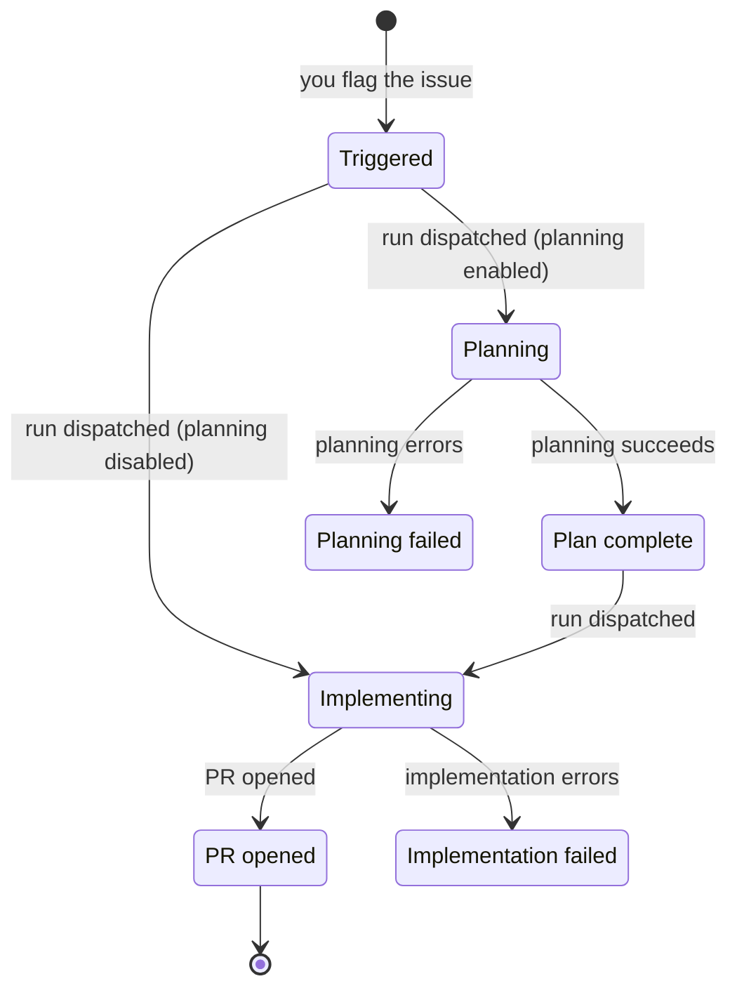

import ExperimentalBanner from "/snippets/experimental-banner.mdx";

<ExperimentalBanner />

Comprehensive reference for the error codes, statuses, and failure messages AI-Implement surfaces. For step-by-step fixes to the most common problems, see [Troubleshooting](/latest/reference/troubleshooting).

<Columns cols={2}>
    <Card title="HTTP API error codes" icon="server" href="#http-api-error-codes">
        Error responses from the orchestrator's HTTP endpoints.
    </Card>

    <Card title="Ticket comments" icon="message" href="#ticket-comments">
        Status and progress comments AI-Implement posts on your issue.
    </Card>

    <Card title="Blocker reasons" icon="ban" href="#blocker-reasons">
        Why an eligible issue was not dispatched.
    </Card>

    <Card title="Job status values" icon="list-check" href="#job-status-values">
        The states a dispatch moves through, end to end.
    </Card>

    <Card title="Run failure messages" icon="triangle-exclamation" href="#run-failure-messages">
        Common planning and implementation failures, and how to fix them.
    </Card>

    <Card title="Issue lifecycle" icon="diagram-project" href="#issue-lifecycle">
        The state diagram of triggers and transitions.
    </Card>
</Columns>

## HTTP API error codes

The orchestrator's HTTP endpoints return an `error` field on any failed request. The tables below list the errors each endpoint can return, grouped by who calls it: [integration and callback endpoints](#integration-and-callback-api) used by **runners** and **automation**, and the [admin API](#admin-api) behind the **admin UI**.

### Response body shapes

A failed request returns a JSON body with a single `error` field:

<ResponseField name="error" type="string">
    The error identifier that varies by endpoint.
    
    - For `/runner/*` and `/trigger/gap-fill`, a stable slug code (for example, `missing_bearer`).
    - For `/api/*` and the webhook, a human-readable message (for example, `Invalid JSON body`).
</ResponseField>

<Note>
    Some responses add fields alongside `error`, noted per endpoint below.
</Note>

### Integration and callback API

These endpoints are called by **runners** (GitHub Actions jobs, Fly Machine sessions, or local Docker containers) and by **external automation**, not from the admin UI. They do not use the admin session — each authenticates with a token or nonce tied to the run or trigger.

#### `POST /runner/result`

A runner reports the final outcome of a dispatch: success with a PR, or failure with error context.

| HTTP | `error` | Condition |
|---|---|---|
| 400 | `invalid_body` | Body is missing or not a JSON object |
| 400 | `invalid_comment_shape` | A comment entry is not an object with a string `body` |
| 400 | `invalid_comments` | `comments` is missing or not an array |
| 400 | `invalid_outcome` | `outcome` is not `success` or `failure` |
| 400 | `invalid_phase` | `phase` is not `planning`, `implementation`, or `gap-analysis` |
| 400 | `missing_prUrl` | A successful implementation result did not include a PR URL |
| 400 | `phase_mismatch` | The token's phase does not match the body |
| 401 | `bad_signature`, `expired`, `malformed`, `wrong_audience` | The run token has a bad signature, is expired, is malformed, or is for the wrong endpoint |
| 401 | `missing_bearer` | Missing or malformed `Authorization: Bearer` header |
| 409 | `already_consumed` | The single-use token was already consumed |

#### `POST /runner/progress`

A runner streams step-by-step progress during a run.

| HTTP | `error` | Condition |
|---|---|---|
| 400 | `invalid_body` | Body is missing or not a JSON object |
| 400 | `invalid_step_id` | `step.id` is missing or not a string |
| 400 | `invalid_step_started_at` | `step.started_at` is missing or not a string |
| 400 | `invalid_step_status` | `step.status` is missing or not a string |
| 400 | `invalid_step_type` | `step.type` is missing or not a string |
| 400 | `step_required` | `step` is missing or not an object |
| 401 | `bad_signature`, `expired`, `malformed`, `wrong_audience` | The progress token has a bad signature, is expired, is malformed, or is for the wrong endpoint |
| 401 | `missing_bearer` | Missing or malformed `Authorization: Bearer` header |
| 404 | `job_not_found` | No run matches the token |

#### `GET /runner/planning-context`

A runner fetches the planning context for its run.

| HTTP | `error` | Condition |
|---|---|---|
| 401 | `bad_signature`, `expired`, `malformed`, `wrong_audience` | The progress token has a bad signature, is expired, is malformed, or is for the wrong endpoint |
| 401 | `missing_bearer` | Missing or malformed `Authorization: Bearer` header |

#### `POST /trigger/gap-fill`

External automation triggers a gap-fill run on an existing pull request.

| HTTP | `error` | Condition |
|---|---|---|
| 400 | `issueKey and positive integer prNumber required` | `issueKey` is missing, or `prNumber` is not a positive integer |
| 401 | `unauthorized` | Missing bearer token, or it does not match the trigger secret |
| 404 | `mapping_not_found` | No configured mapping owns an issue with this key |
| 423 | `project_paused` | The owning mapping is paused (response also includes `teamKey`) |
| 501 | `Gap fill trigger not configured` | The gap-fill trigger is not configured on this orchestrator |
| 502 | `dispatch_failed` | The workflow dispatch to GitHub failed (response also includes `detail` and `dispatchStatus`) |

#### `POST /api/token`

A session requests a short-lived GitHub token, issued against a one-time nonce.

| HTTP | `error` | Condition |
|---|---|---|
| 400 | `nonce and owner are required` | `nonce` or `owner` is missing |
| 403 | `Invalid or expired nonce` | No active job matches the nonce |
| 403 | `Owner mismatch` | The `owner` does not match the job's repository owner |
| 500 | `Failed to generate token` | The body was not valid JSON, or token generation failed |

#### `POST /api/status`

A session posts a lifecycle status event, which becomes a comment on the issue.

| HTTP | `error` | Condition |
|---|---|---|
| 400 | `event is required` | `event` is missing or not a string |
| 400 | `Invalid JSON body` | Body could not be parsed as JSON |
| 400 | `nonce is required` | `nonce` is missing or not a string |
| 400 | `Unknown event type: {type}` | `event` is not an allowed remote event type |
| 403 | `Invalid or expired nonce` | No active job matches the nonce |
| 500 | `Internal server error` | An unexpected error occurred (for example, posting the status comment failed) |

#### `POST /api/step-report`

A runner reports the status of a single pipeline step.

| HTTP | `error` | Condition |
|---|---|---|
| 400 | `nonce is required` | `nonce` is missing or not a string |
| 400 | `Invalid JSON body` | Body could not be parsed as JSON |
| 400 | `step is required` | `step` is missing or not an object |
| 400 | `step.id is required and must be a string` | A required step field (`id`, `type`, `status`, `started_at`) is missing or not a string |
| 403 | `Invalid or expired nonce` | No active job matches the nonce |
| 500 | `Internal server error` | An unexpected error occurred while persisting the step |

#### `POST /api/github/webhook`

GitHub notifies the orchestrator of pull-request events.

<Note>
    Events that don't match a merged pull request return `200` and are ignored.
</Note>

| HTTP | `error` | Condition |
|---|---|---|
| 400 | `Invalid JSON payload` | Body could not be parsed as JSON |
| 400 | `Missing required PR fields` | The merged-PR payload is missing a required field (number, URL, branch, merge-commit SHA, or repository) |
| 401 | `Invalid signature` | The `X-Hub-Signature-256` did not verify against the webhook secret |

### Admin API

These endpoints support the admin UI. See [Admin UI](/latest/reference/admin-ui) for what each panel does.

<Tip>
    Some sections below cover several related endpoints that return the same errors.
</Tip>

<Info>
    Every admin endpoint below requires a valid admin session except `POST /api/auth`.
    
    Requests without one return `401` with `Unauthorized`.
</Info>

#### `POST /api/auth`

Exchange the admin access code for a session token.

| HTTP | `error` | Condition |
|---|---|---|
| 400 | `Invalid request body` | Body could not be parsed as JSON |
| 403 | `Invalid access code` | The access code does not match |

#### Job steps and issue lists

- `GET /api/jobs/{jobId}/steps` returns a job's step history
- `GET /api/issues` lists tracked issues
- `GET /api/blockers` lists issues currently blocked from dispatch

| HTTP | `error` | Condition |
|---|---|---|
| 404 | `job not found` | No job with that ID |
| 502 | *(underlying error message)* | Fetching issues from the ticketing provider failed |

<Warning>
    Responses shown as *(underlying error message)* return the raw error text with a `500` or `502` status, not a stable code. Treat them as diagnostic detail — the wording can change between releases.
</Warning>

#### `POST /api/mappings`

Create or update a project mapping.

<Note>
    Every field validation returns `400` with a message naming the problem.
</Note>

**Required fields**

| HTTP | `error` | Condition |
|---|---|---|
| 400 | `defaultBranch is required` | No default branch was given, and the mapping has none set |
| 400 | `Invalid request body` | Body could not be parsed as JSON |
| 400 | `teamKey, owner, and repo are required` | One of these required fields is missing |

**Claude provider**

| HTTP | `error` | Condition |
|---|---|---|
| 400 | `awsRegion is required when provider is 'bedrock'` | `provider` is `bedrock` but no AWS region was given |
| 400 | `provider 'bedrock' is not supported with executionMode 'fly-machines'` | `bedrock` was combined with `fly-machines` |
| 400 | `provider must be 'anthropic' or 'bedrock'` | `provider` is some other value |

**Execution and resources**

| HTTP | `error` | Condition |
|---|---|---|
| 400 | `executionMode must be 'github-actions' or 'fly-machines'` | `executionMode` is some other value |
| 400 | `machineCpus must be a positive integer` | `machineCpus` is below 1 or not an integer |
| 400 | `machineMemoryMb must be an integer >= 256` | `machineMemoryMb` is below 256 or not an integer |
| 400 | `sessionMode must be 'autonomous', 'interactive', or 'hybrid'` | `sessionMode` is some other value |

**Other settings**

| HTTP | `error` | Condition |
|---|---|---|
| 400 | `branchPrefix invalid: {detail}` | The branch prefix is invalid |
| 400 | `extraEnv must be a plain object` | `extraEnv` is set but is not an object |
| 400 | `extraEnv values must all be strings` | An `extraEnv` value is not a string |
| 400 | `maxInProgressAiIssues must be a positive integer` | `maxInProgressAiIssues` is below 1 or not an integer |
| 400 | `planningWorkflowFile is required when planningEnabled is true` | Planning is enabled but no planning workflow file was given |
| 400 | *(ticketing validation message)* | The ticketing provider configuration is invalid |

#### Mapping changes

- `PATCH /api/mappings/{teamKey}` updates a mapping's concurrency cap or paused state
- `DELETE /api/mappings/{teamKey}` removes a mapping

| HTTP | `error` | Condition |
|---|---|---|
| 400 | `Invalid request body` | Body could not be parsed as JSON |
| 400 | `maxInProgressAiIssues must be a positive integer` | The new cap is below 1 or not an integer |
| 400 | `Specify either paused or maxInProgressAiIssues, not both` | The request set both fields at once |
| 404 | `Team not found` | No mapping with that team key |

<Note>
    `DELETE` returns `404` with `{ "deleted": false }` (no `error` field) when the mapping does not exist.
</Note>

#### `POST /api/mappings/{teamKey}/sync-workflows`

Re-sync workflow templates into the mapping's repository.

| HTTP | `error` | Condition |
|---|---|---|
| 404 | `Team not found` | No mapping with that team key |
| 500 | *(underlying error message)* | The sync to GitHub failed |

#### Jira configuration

- `POST /api/jira/validate-jql` validates a JQL clause
- `GET /api/jira/fields` lists Jira fields
- `GET /api/jira/field-options` lists the options for a Jira field

| HTTP | `error` | Condition |
|---|---|---|
| 400 | `Invalid JSON body` | The validate-jql body could not be parsed |
| 400 | `fieldId query param required` | `/api/jira/field-options` was called without `fieldId` |
| 400 | `jql field required` | The validate-jql body omitted `jql` |
| 400 | *(validation message)* | The JQL clause is invalid |
| 500 | *(underlying error message)* | The Jira request failed |
| 501 | `Jira not configured` | No Jira connection is configured on this orchestrator |

<Note>
    `/api/jira/field-options` returns an empty list, not an error, when the field has no selectable options.
</Note>

#### `POST /api/runner-mode`

Override the global runner execution mode.

| HTTP | `error` | Condition |
|---|---|---|
| 400 | `Invalid request body` | Body could not be parsed as JSON |
| 400 | `mode must be one of: default, gha, fly, local, shadow` | `mode` is not a recognized value |
| 409 | `RUNNER_MODE env var is set; persisted to DB but has no effect at runtime until the env var is unset` | The value was saved, but a `RUNNER_MODE` environment variable overrides it at runtime |

#### Sessions

- `GET /api/sessions` lists active sessions
- `DELETE /api/sessions/{machineId}` destroys a session

| HTTP | `error` | Condition |
|---|---|---|
| 500 | *(underlying error message)* | Listing or destroying the session failed |
| 503 | `Fly sessions config not set` | Destroying a session while Fly sessions are not configured |

<Note>
    `GET /api/sessions` returns an empty list, not an error, when Fly sessions are not configured.
</Note>

#### Secrets

- `/api/mappings/{teamKey}/secrets` lists, sets, and deletes per-team secrets
- `/api/global-secrets` lists, sets, and deletes global secrets

| HTTP | `error` | Condition |
|---|---|---|
| 400 | `Invalid request body` | Body could not be parsed as JSON |
| 400 | `name and value are required` | The secret name is missing, or the value is missing or empty |
| 400 | `name must contain only letters, digits, and underscores` | The secret name contains other characters |
| 400 | `Secret name must not start with a team key prefix (...)` | A global secret name collides with a team prefix |
| 404 | `Secret not found` | The named secret does not exist (on delete) |
| 404 | `Team not found` | No mapping with that team key (per-team secrets) |
| 500 | *(underlying error message)* | The secret operation failed |
| 503 | `Fly sessions config not set` | Secrets require Fly sessions to be configured |

## Ticket comments

AI-Implement comments on the issue it is working so you can follow a run from your issue tracker, without watching the admin UI or the GitHub Actions logs.

There are two kinds: **progress comments** posted at each stage of a session run, and **outcome comments** posted when a run opens a PR or fails.

### Progress comments

When a run executes in a session (Fly Machines or local Docker), AI-Implement posts a comment at each stage:

| Comment | When |
|---|---|
| 🚀 Session machine created. Cloning repo and running setup... | A session machine is provisioned |
| ✅ Environment ready. Claude is implementing... | The repository is cloned and dependencies are installed |
| 📝 Claude finished. PR #{number} opened: {url} | Claude finishes and opens a pull request |
| 🧪 Running verification script... | The verification script starts |
| ✅ Verification passed | The verification script passes |
| ❌ Verification failed: {summary} | The verification script fails |
| 🧹 Session machine cleaned up. Duration: {duration} | The session machine is torn down |
| ⚠️ Session failed: {reason}. Machine will be cleaned up. | The run errors out |
| ⚠️ Session timed out: {reason}. Machine will be cleaned up. | The run exceeds its time budget |

<Note>
    Each comment also includes a timestamp, and a link to the machine logs when one is available.
</Note>

### Outcome comments

These report how a run finished:

- A pull-request link, posted when the run opens a PR.
- A failure notice when a run errors out: `⚠️ Planning failed: {reason}` or `⚠️ Implementation failed: {reason}`.
- A log excerpt, posted on a terminal failure or timeout and labeled with the context below.

<Note>
    `{reason}` is the underlying failure message from the run.
    
    See [Run failure messages](#run-failure-messages) for what these messages contain and how to resolve them.
</Note>

| Log label | Meaning |
|---|---|
| container_failed | The local Docker container exited with an error |
| container_timeout | The local Docker session exceeded its lifetime |
| machine_timeout | The session machine exceeded its lifetime |
| post_push_review_not_approved | A PR was opened, but the post-push review flagged blockers |
| pr_not_found | The run finished but did not open a PR |
| session_failed | The session run failed |

## Blocker reasons

The orchestrator checks for eligible issues on a schedule. When it skips one, the Blockers view in the admin UI shows why.

Most reasons clear on their own once the condition changes — a slot frees up, or the dedup window passes — but `no-mapping` needs you to add a project mapping.

| Reason | Message shown | When |
|---|---|---|
| `concurrency` | {team} at concurrency cap ({current}/{max}). Waiting for a slot. | The team is at its maximum number of in-progress issues |
| `dedup` | Already dispatched recently. Waiting for the in-flight job. | The issue was dispatched within the last 24 hours |
| `no-mapping` | No mapping for team {team}. Add one in Projects. | The issue's team has no project mapping |

<Note>
    An issue is also skipped if it has open blocking issues linked to it. That is a separate eligibility check, not one of the reasons above.
</Note>

For step-by-step help when an issue is not picked up, see [Troubleshooting](/latest/reference/troubleshooting).

## Job status values

Each dispatch moves through these statuses, shown in the dispatch log and the issue list.

**Non-terminal** statuses describe a run still in flight; **terminal** statuses are the final outcome and do not change afterward.

| Status | Terminal | Meaning |
|---|---|---|
| `unknown` | No | Initial state, before a run is linked |
| `dispatched` | No | The workflow was dispatched; awaiting a run |
| `running` | No | The run is in progress |
| `completed` | Yes | The run succeeded and a PR was opened |
| `review_failed` | Yes | A PR was opened, but the post-push review flagged blockers |
| `failed` | Yes | The run errored, or finished without opening a PR |
| `timed_out` | Yes | The run exceeded its time budget |

A `timed_out` status carries one of these reasons:

| Reason | Meaning |
|---|---|
| `container_timeout` | The local Docker session exceeded its lifetime |
| `machine_timeout` | The session machine exceeded its lifetime (around 60 minutes) |
| `run_not_found` | A run was never linked within the time limit (around 10 minutes) |
| `timed_out` | The GitHub Actions run reported a timeout |

For how completion statuses appear in Slack or Teams, see [Notifications](/latest/reference/notifications).

## Run failure messages

When a planning or implementation run fails, AI-Implement posts the reason on the issue as `⚠️ Planning failed: {reason}` or `⚠️ Implementation failed: {reason}`. The `{reason}` pairs a short note about which step failed with the underlying error from the tool involved (Claude, git, or the package manager).

The most common failures are listed below.

<AccordionGroup>
    <Accordion title="Reached max turns" description="The run stopped at the per-run turn limit before finishing">
        Example: `Implementation failed: LLM invocation failed with exit code 1 … Reached max turns (50)`

        Claude stopped because it reached the maximum number of turns allowed for a single run — the work was too large to finish in the limit, or the run got stuck repeating steps.

        See [Troubleshooting](/latest/reference/troubleshooting#reached-max-turns) for information on how to raise the limit.
    </Accordion>

    <Accordion title="The Claude run failed" description="Claude ended with an error before finishing">
        Example: `Implementation failed: LLM invocation failed with exit code 1: …`

        Claude's run ended with an error rather than completing — for example an API error or a loss of context. The exit code and the end of the message point to the underlying cause.
    </Accordion>

    <Accordion title="No changes were produced" description="Claude finished without editing any files">
        Example: `Implementation failed: Nothing to commit: Claude left no file changes in the working tree`

        Claude finished without changing any files, so there was nothing to open a pull request with. The issue may already be addressed, or may need more detail before a re-run.
    </Accordion>

    <Accordion title="Pushing the branch or opening the PR failed" description="The push or pull-request creation was rejected">
        Example: `Implementation failed: PR creation failed with HTTP 422: …`

        AI-Implement could not push the branch or open the pull request — commonly branch protection rules, missing repository permissions, or a pull request already open for the branch.
    </Accordion>

    <Accordion title="Cloning the repository failed" description="The target repository could not be checked out">
        Example: `Implementation failed: git clone failed (exit 128): …`

        The runner could not clone or check out the target repository — commonly repository access or permissions, or a missing branch.
    </Accordion>

    <Accordion title="Blocked by a security guardrail" description="A staged change looked like a secret, so the push was blocked">
        Before pushing, AI-Implement scans the staged files for anything that looks like a secret. If a staged file matches a sensitive pattern, it blocks the push and marks the implementation failed rather than risk committing a credential.

        On the issue you'll see a comment that starts with `🔒 Blocked by security guardrail`, followed by `Push blocked: N sensitive file(s) would be committed:` and then each offending file with the reason it was flagged.

        A file is flagged when it falls into one of these categories, with a few examples of each:

        - **Environment and config files** — `.env`, `secrets.yml`, or a `credentials.yml.enc`.
        - **Private keys and certificates** — `.pem` and `.key` files, or an SSH key like `id_rsa`.
        - **Cloud credentials** — an AWS `credentials` file, a GCP service-account JSON, or a `.tfstate`.
        - **Database credentials** — a `.pgpass` file or a `database.yml`.
        - **Tokens and auth files** — `.npmrc`, `.netrc`, or a `kubeconfig`.

        To resolve it, remove the file from the change, or add it to `.gitignore` so it's never staged, then re-run the issue.
    </Accordion>
</AccordionGroup>

## Issue lifecycle

AI-Implement moves each issue through a fixed set of stages. The diagram shows the stages and what moves an issue between them.

<Note>
    See [Triggers and status indicators](/latest/reference/labels) for how each stage maps to a Linear label or Jira status, and how to re-run after a failure.
</Note>

Each stage shows up as a Linear label or a Jira status:

| Stage | Linear label | Jira status |
|---|---|---|
| Triggered | `AI-Implement` (you add) | `Ready` |
| Planning | `AI-Planning` | `Planning` |
| Plan complete | `Plan-Complete` | `Plan Approved` |
| Implementing | `AI-Working` | `Implementing` |
| PR opened | `Ready for Review` | `PR Ready` |
| Planning failed | AI labels removed, plus a comment | `Planning Failed` |
| Implementation failed | AI labels removed, plus a comment | `Implementation Failed` |
