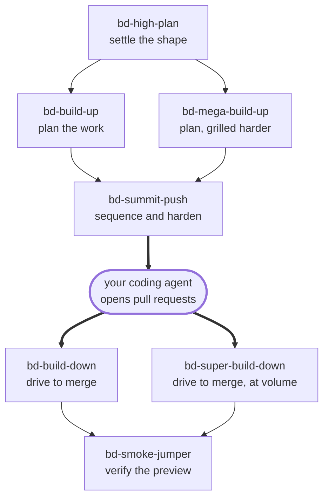
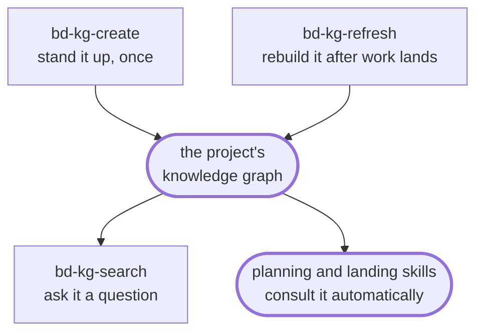

import ExperimentalBanner from "/snippets/experimental-banner.mdx";

<ExperimentalBanner />

Running a ticket-to-pull-request pipeline surfaces a handful of recurring questions. Each has a skill that answers it:

- The shape of the work isn't settled yet — what are the big pieces, and in what order? **→** **`bd-high-plan`**
- I have a design or an objective — how do I turn it into well-scoped tickets the agent can finish in one pass? **→** **`bd-build-up`**, or **`bd-mega-build-up`** when the design should be pressure-tested first
- I have a stack of planned tickets — what order should they go out in, and which will fail without more context? **→** **`bd-summit-push`**
- I have a pile of open pull requests from the agent — which merge, which need another pass, and which are blocked? **→** **`bd-build-down`**, or **`bd-super-build-down`** for many at once
- Did the preview actually work, or did the agent just make the diff look right? **→** **`bd-smoke-jumper`**
- Has this already been decided, tried, or filed before? **→** **`bd-kg-search`**
- Why isn't my ticket running? **→** **`bd-system-questions`**

<Note>
  A few sit outside that sequence:
  - `bd-kg-create` and `bd-kg-refresh` stand up and update the project memory that `bd-kg-search` reads
  - `bd-belay-on` formalizes handing a question to a different tool at any point along the way
</Note>

## How the skills fit together

### Issue lifecycle

### Knowledge graph

## What they have in common

The skills share one autonomy model, so a skill either acts or asks for the same reasons throughout.

They also read the same project bindings from the orchestrator at the start of each session, rather than each asking you where your issues live.

They assume a common setup: a connected ticketing system, a connected GitHub account, browser automation for preview testing, and a coding agent that responds to pull request comments.

Most run entirely inside your own Claude Code session, separate from the AI-Implement orchestrator that later picks up a marked issue and opens the pull request. `bd-system-questions` is the one that needs the orchestrator outright — it asks the orchestrator about itself, and does nothing without one.

A bound knowledge graph changes the picture more softly. Every planning and landing skill consults it before acting, as does `bd-belay-on`, and all of them skip silently on a project that has none.

### Ticketing support

**Ticketing provider support varies by skill.** `bd-build-up`, `bd-mega-build-up`, and `bd-build-down` carry dedicated Jira handling alongside Linear.

`bd-summit-push` and `bd-super-build-down` describe Jira behavior projected from their Linear behavior rather than fully adapted to it, so **Linear assumptions may show through on Jira projects**.

<Note>
  `bd-smoke-jumper` needs a ticketing system too — to read issue context and file the failures it finds — but treats Linear and Jira identically rather than branching its behavior. `bd-belay-on` is the only skill with no ticketing dependency at all.
</Note>

### Feature-branch grouping

Every planning and landing skill understands feature-branch grouping. When a parent issue and its children are marked together, they treat the tree as one unit that rolls up to a single reviewable pull request rather than as unrelated issues.

## Available skills

### Plan the work

| Skill | What it does |
| --- | --- |
| `bd-high-plan` | Settles the **shape** of a new capability before any decomposition — a few discrete, separately testable steps, decided one question at a time and filed as a single planning issue. |
| `bd-build-up` | Turns an objective or design into a **sequenced, dependency-aware set of issues**, shown for your review before anything is filed. |
| `bd-mega-build-up` | A deeper `bd-build-up` for larger work — pressure-tests the design first, then files issues alongside decision records written into your repository. |
| `bd-summit-push` | Optimizes a set of planned issues — their order, dependencies, and wording — for the best chance of one-shot success through the pipeline. |

### Land the work

| Skill | What it does |
| --- | --- |
| `bd-build-down` | Drives open pull requests to merge: reviews each against its gap analysis, resolves what's missing, and lands the ones that are ready. |
| `bd-super-build-down` | A faster, hands-off `bd-build-down` for many pull requests at once or unattended runs. |
| `bd-smoke-jumper` | Smoke-tests a pull request's preview deploy, posts a verdict, and files issues for anything that fails. |

### Project knowledge

| Skill | What it does |
| --- | --- |
| `bd-kg-create` | Stands up a project's knowledge graph for the first time, then hands off to the skills that build and bind it. |
| `bd-kg-refresh` | Rebuilds the project's knowledge graph so searches reflect current code and issue state. Admin-only: needs an allowlist entry with role admin on the orchestrator; see [MCP tools](/latest/reference/mcp-tools). |
| `bd-mega-kg-refresh` | A local, interactive `bd-kg-refresh` — interrogates the served graph, tests ingest changes with you, opens a PR on the knowledge-graph repo, then hands off to the rail. Admin-only: needs an allowlist entry with role admin on the orchestrator; see [MCP tools](/latest/reference/mcp-tools). |
| `bd-kg-search` | Asks the project's knowledge graph what past issues, pull requests, and decisions already cover a question. |

### Support

| Skill | What it does |
| --- | --- |
| `bd-system-questions` | Asks the orchestrator why a ticket isn't running, what's in flight, and how the system is configured. |
| `bd-belay-on` | Coordinates handing a task off to another tool and folding the results back in cleanly. |

## Next step

<Card title="Install the skills" icon="download" href="/latest/skills/installation">
  Add the plugin to Claude Code and choose a release channel.
</Card>
