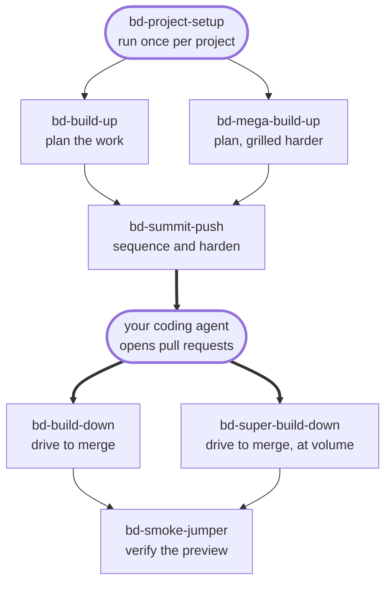

import ExperimentalBanner from "/snippets/experimental-banner.mdx";

<ExperimentalBanner />

Running a ticket-to-pull-request pipeline surfaces four recurring questions. Each has a skill that answers it:

- I have a design or an objective — how do I turn it into well-scoped tickets the agent can finish in one pass? **→** **`bd-build-up`** or **`bd-mega-build-up`** when the design should be pressure-tested first
- I have a stack of planned tickets — what order should they go out in, and which will fail without more context? **→** **`bd-summit-push`**
- I have a pile of open pull requests from the agent — which merge, which need another pass, and which are blocked? **→** **`bd-build-down`** or **`bd-super-build-down`** for many at once
- Did the preview actually work, or did the agent just make the diff look right? **→** **`bd-smoke-jumper`**

These skills run inside your own Claude Code session while you plan and review. They're separate from the AI-Implement orchestrator, which is what later picks up a marked issue and opens the pull request.

<Note>
    The remaining skills sit outside that sequence:
    - `bd-project-setup` runs once to wire a project to its tools
    - `bd-belay-on` formalizes handing a question to a different tool at any point along the way
    - `bd-high-plan` settles the shape of a new capability before `bd-build-up` or `bd-mega-build-up` breaks any part of it into issues
    - `bd-kg-create`, `bd-kg-refresh`, and `bd-kg-search` build, refresh, and search a project's knowledge graph, usable once a project has one bound
    - `bd-system-questions` asks the AI-Implement orchestrator direct status questions at any point
</Note>

## How the skills fit together

## What ties them together

The skills share one autonomy model, so a skill either acts or asks for the same reasons throughout.

They also read the same recorded project bindings rather than each asking you where your issues live — which is what `bd-project-setup` exists to write.

They assume a common setup: a connected issue tracker, a connected GitHub account, browser automation for preview testing, and a coding agent that responds to pull request comments.

Six of the thirteen understand feature-branch grouping. When a parent issue and its children are marked together, they treat the tree as one unit that rolls up to a single reviewable pull request rather than as unrelated issues.

## Available skills

| Skill | What it does |
| --- | --- |
| `bd-project-setup` | Wires a project to its tools once — creates the tracker connection, authorizes it, and **records the settings every other skill reads**. |
| `bd-high-plan` | Settles the shape of a new capability — a small, agreed set of simple steps captured as one planning parent issue — before any detailed decomposition. Sits in front of `bd-build-up`. |
| `bd-build-up` | Turns an objective or design into a **sequenced, dependency-aware set of tracker issues**, shown for your review before anything is filed. |
| `bd-mega-build-up` | A deeper `bd-build-up` for larger work — pressure-tests the design first, then files issues alongside attached design and plan documents. |
| `bd-summit-push` | Optimizes a set of planned issues — their order, dependencies, and wording — for the best chance of one-shot success through the pipeline. |
| `bd-build-down` | Drives open pull requests to merge: reviews each against its gap analysis, resolves what's missing, and lands the ones that are ready. |
| `bd-super-build-down` | A faster, hands-off `bd-build-down` for many pull requests at once or unattended runs. |
| `bd-smoke-jumper` | Smoke-tests a pull request's preview deploy, posts a verdict, and files issues for anything that fails. |
| `bd-belay-on` | Coordinates handing a task off to another tool and folding the results back in cleanly. |
| `bd-kg-create` | Builds a project's knowledge-graph repo from the base template, then hands off to `bd-kg-refresh` and `bd-project-setup` to build and bind it. |
| `bd-kg-refresh` | Refreshes a project's bound knowledge graph so hybrid search reflects the current code and tracker state. |
| `bd-kg-search` | Searches a project's knowledge graph directly — the fast way to check what past issues, PRs, decisions, and learnings already exist. |
| `bd-system-questions` | Asks the AI-Implement orchestrator direct questions — why a ticket isn't running, whether a pipeline is stuck, overall health, the project list, and the runner mode. |

<Note>
  `bd-kg-create`, `bd-kg-refresh`, `bd-kg-search`, and `bd-system-questions` need a knowledge-graph binding or an orchestrator MCP connection to do anything — each no-ops with a clear message if the project has neither bound. `bd-project-setup`'s knowledge-graph phase is what binds one.
</Note>

**Tracker support varies by skill.** `bd-build-down`, `bd-mega-build-up`, `bd-build-up`, and `bd-super-build-down` carry dedicated Jira handling alongside Linear.

`bd-summit-push` describes Jira behavior projected from its Linear behavior rather than fully adapted to it, so **Linear assumptions may show through on Jira projects**.

<Note>
  `bd-project-setup` binds either tracker, and the remaining skills don't depend on one.
</Note>

## Next step

<Card title="Install the skills" icon="download" href="/latest/skills/installation">
  Add the plugin to Claude Code and choose a release channel.
</Card>
