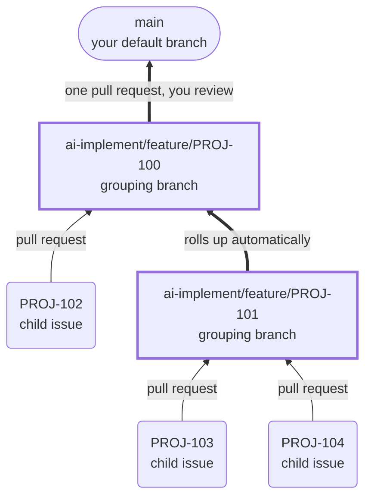

When you mark a parent issue and its children for AI-Implement, they stop being independent runs. The children open pull requests into a **shared branch** owned by the parent instead of into your default branch, and when the whole tree is finished you get **one** pull request to review rather than one per issue.

Nothing changes for ordinary work. An issue with no children behaves exactly as it always has.

## How a tree becomes branches

Each parent issue owns one grouping branch. Its children target that branch, and the structure nests as deeply as your issue tree does.



Branches are created the first time a child actually runs, not when you mark the tree. If branch creation fails for any reason, the run falls back to targeting your default branch — a grouping problem never blocks the work itself.

## Marking a tree

You can mark the whole tree at once. The ordering rules below sequence it for you.

<Tabs>
  <Tab title="Linear">
    Apply the `AI-Implement` label to the parent and to every child you want worked on.

    Children without the label are ignored, so you can roll a tree out incrementally — label two children now, the rest later.
  </Tab>
  <Tab title="Jira">
    Set the **AI-Implement Status** field on the parent and children, and make sure each one's **AI-Implement Repo** field matches the project mapping.

    Hierarchy comes from the issue's parent field, falling back to the classic **Epic Link** field — so Epic-to-Story trees group the same way.
  </Tab>
</Tabs>

<Note>
  Marking a parent before its children is safe. A parent that has children but none marked yet is left alone rather than being treated as ordinary work — so it won't be implemented prematurely while you finish marking.
</Note>

## When each issue runs

| Situation | What happens |
|---|---|
| Issue has no children | Runs as soon as capacity allows; its pull request targets the nearest parent's grouping branch |
| Parent still has children in flight | Waits |
| Parent's children are all finished | The parent's own work runs, landing on its own grouping branch |
| Issue is blocked by an open blocking relation | Waits |

A parent can carry work of its own — a final cleanup, a piece of integration — that isn't part of any child. That work is deliberately held until every child is finished, so it builds on top of them rather than racing them.

<Tip>
  "Finished" includes cancelled. Cancelling a child you've decided against releases the parent instead of stalling it.
</Tip>

## Rolling completed work back up

As each parent's branch completes, its work is merged up into its own parent's branch automatically — no pull request, because an intermediate review step would just be noise.

The exception is the top of the tree. That one becomes a **pull request into your default branch, for a human to review**, and it is never merged automatically. Its description lists every issue that went into it.

Merge that final pull request however you like — merge commit, squash, or rebase all work. The orchestrator notices it merged, deletes the grouping branch, and marks the top issue done.

## Merging child pull requests automatically

By default every child pull request waits for a human, same as any other. Turning on **Auto Merge** for a project changes that: child pull requests are merged into their grouping branch once they're ready.

A child is merged only when all of the following hold:

- It targets a grouping branch — never your default branch
- It isn't a draft
- Its checks have finished, and passed
- No reviewer has requested changes

Anything else is left alone. Pending checks are waited on, failures and change-requests are skipped, and a pull request that can't be merged cleanly is left for you.

<Note>
  A run whose automated review found blockers opens its pull request as a **draft**. Because auto-merge skips drafts, flagged work is never merged past you even with the setting on.
</Note>

<Warning>
  Auto Merge never merges into your default branch. The final pull request out of the tree always waits for human review.
</Warning>

Turn it on per project — see [`autoMerge`](/configuration/team-repo-mappings#param-auto-merge) in the project mapping reference.

## Naming the grouping branch

Grouping branches are named `ai-implement/feature/<issue-key>` by default. A parent issue can choose a different path segment by embedding a configuration block in its description:

````
```
# ai-implement.yml
feature_branch:
  mode: "multi-issue"
```
````

That produces `ai-implement/multi-issue/<issue-key>` instead. The two modes differ only in the branch name — everything else about grouping behaves identically.

The block is recognized by its first line being exactly `# ai-implement.yml`; the fence language doesn't matter. AI-Implement strips the block from the description before the agent sees it, so it never gets mistaken for part of the work.

<Tip>
  Anything unrecognized — a missing block, invalid YAML, an unknown mode — quietly falls back to the default. A configuration mistake will never block a dispatch.
</Tip>

## Before you rely on grouping

<Steps>
  <Step title="Make sure your target repo has current workflow files">
    Grouping sends child pull requests to a branch other than your default, which the target repo's workflow file must accept. If the repo hasn't been synced in a while, use the **Sync workflows** action on its project row in the admin UI.
  </Step>

  <Step title="Make sure the runner callback is reachable">
    A tree advances on its own only if planning can complete, which depends on runners being able to call back to the orchestrator. On a purely local orchestrator that callback can't be reached, so the cascade won't self-drive.
  </Step>
</Steps>
