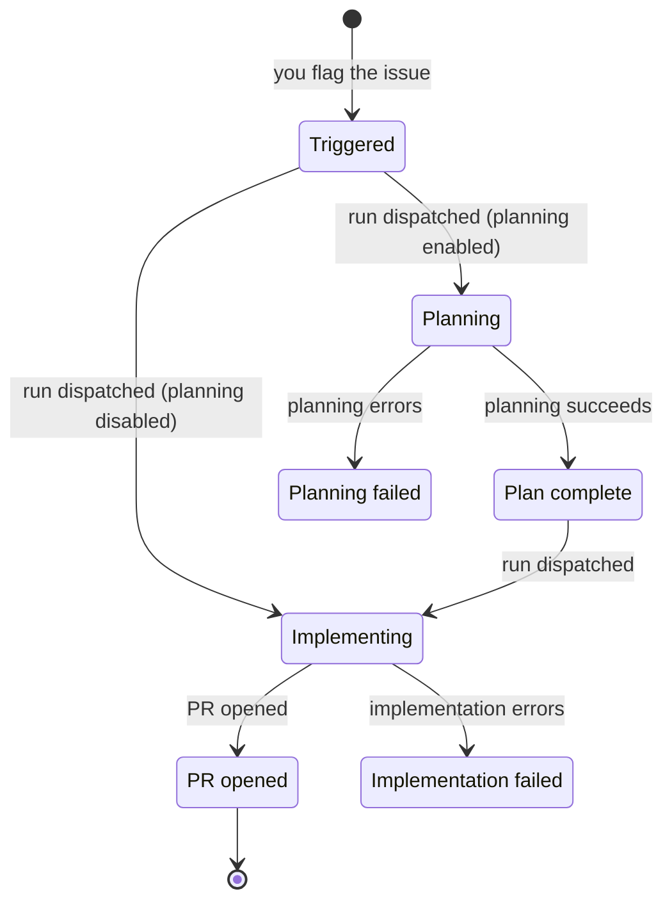

<Columns cols={2}>
    <Card title="API error codes" icon="server" href="/reference/error-codes">
        Error responses from the orchestrator's HTTP endpoints.
    </Card>

    <Card title="Troubleshooting" icon="wrench" href="/reference/troubleshooting">
        Step-by-step fixes for the most common problems.
    </Card>
</Columns>

## Issue, dispatch, job and run

This page uses four words for four different things:

- **Issue** — the ticket in Linear or Jira that you flag.
- **Dispatch** — the orchestrator starting a workflow for that issue.
- **Job** — the orchestrator's record of one dispatch, and what carries a status.
- **Run** — the workflow execution itself, and what produces a failure message.

One issue can accumulate several jobs over time, and each job is matched to at most one run — a job whose run never appears is the `run_not_found` case below.

## Issue lifecycle

AI-Implement moves each issue through a fixed set of stages. The diagram shows the stages and what moves an issue between them.

<Note>
    See [Triggers and status indicators](/reference/labels) for how each stage maps to a Linear label or Jira status, and how to re-run after a failure.
</Note>

Each stage shows up as a Linear label or a Jira status:

| Stage | Linear label | Jira status |
|---|---|---|
| Triggered | `AI-Implement` (you add) | `Ready` |
| Planning | `AI-Planning` | `Planning` |
| Plan complete | `Plan-Complete` | `Plan Approved` |
| Implementing | `AI-Working` | `Implementing` |
| PR opened | `Ready for Review` | `PR Ready` |
| Planning failed | AI labels removed, plus a comment | `Planning Failed` |
| Implementation failed | AI labels removed, plus a comment | `Implementation Failed` |

## Ticket comments

AI-Implement comments on the issue it is working so you can follow a run from your issue tracker, without watching the admin UI or the GitHub Actions logs.

There are two kinds: **progress comments** posted at each stage of a session run, and **outcome comments** posted when a run opens a PR or fails.

### Progress comments

When a run executes in a session (Fly Machines or local Docker), AI-Implement posts a comment at each stage:

| Comment | When |
|---|---|
| 🚀 Session machine created. Cloning repo and running setup... | A session machine is provisioned |
| ✅ Environment ready. Claude is implementing... | The repository is cloned and dependencies are installed |
| 📝 Claude finished. PR #{number} opened: {url} | Claude finishes and opens a pull request |
| 🧪 Running verification script... | The verification script starts |
| ✅ Verification passed | The verification script passes |
| ❌ Verification failed: {summary} | The verification script fails |
| 🧹 Session machine cleaned up. Duration: {duration} | The session machine is torn down |
| ⚠️ Session failed: {reason}. Machine will be cleaned up. | The run errors out |
| ⚠️ Session timed out: {reason}. Machine will be cleaned up. | The run exceeds its time budget |

<Note>
    Each comment also includes a timestamp, and a link to the machine logs when one is available.
</Note>

### Outcome comments

These report how a run finished:

- A pull-request link, posted when the run opens a PR.
- A failure notice when a run errors out: `⚠️ Planning failed: {reason}` or `⚠️ Implementation failed: {reason}`.
- A log excerpt, posted on a terminal failure or timeout and labeled with the context below.

<Note>
    `{reason}` is the underlying failure message from the run.
    
    See [Run failure messages](#run-failure-messages) for what these messages contain and how to resolve them.
</Note>

| Log label | Meaning |
|---|---|
| container_failed | The local Docker container exited with an error |
| container_timeout | The local Docker session exceeded its lifetime |
| machine_timeout | The session machine exceeded its 60-minute lifetime |
| post_push_review_not_approved | A PR was opened as a draft because the post-push review flagged blockers |
| pr_not_found | The run finished but did not open a PR |
| session_failed | The session run failed |

## Blocker reasons

The orchestrator checks for eligible issues on a schedule. When it skips one, the Blockers view in the admin UI shows why.

Most reasons clear on their own once the condition changes — a slot frees up, or the issue's dedup entry is cleared — but `no-mapping` needs you to add a project mapping.

| Reason | Message shown | When |
|---|---|---|
| `concurrency` | {team} at concurrency cap ({current}/{max}). Waiting for a slot. | The team is at its maximum number of in-progress issues |
| `dedup` | Already dispatched recently. Waiting for the in-flight job. | The issue was already dispatched and its dedup entry hasn't cleared yet |
| `no-mapping` | No mapping for team {team}. Add one in Projects. | The issue's team has no project mapping |

<Note>
    An issue is also skipped if it has open blocking issues linked to it. That is a separate eligibility check, not one of the reasons above.
</Note>

For step-by-step help when an issue is not picked up, see [Troubleshooting](/reference/troubleshooting).

## Job status values

Each job moves through these statuses, shown in the dispatch log and the issue list.

**Non-terminal** statuses describe a run still in flight; **terminal** statuses are the final outcome and do not change afterward.

| Status | Terminal | Meaning |
|---|---|---|
| `unknown` | No | Initial state, before a run is linked |
| `dispatched` | No | The workflow was dispatched; awaiting a run |
| `running` | No | The run is in progress |
| `completed` | Yes | The run succeeded and a PR was opened |
| `review_failed` | Yes | A PR was opened, but the post-push review flagged blockers |
| `failed` | Yes | The run errored, or finished without opening a PR |
| `timed_out` | Yes | The run exceeded its time budget |

A `timed_out` status carries one of these reasons:

| Reason | Meaning |
|---|---|
| `stuck_requeued` | Recovery requeued the issue for another attempt. See [Overdue run recovery](#overdue-run-recovery). |
| `stuck_giveup` | Recovery gave up with the retry budget spent, and handed the issue back to a person. See [Overdue run recovery](#overdue-run-recovery). |
| `machine_max_age_sweep` | The reconciliation sweep ended a Fly Machine session that had reached the 4-hour maximum session age. |
| `issue_completed_sweep` | The reconciliation sweep ended a Fly Machine session whose issue was already completed or cancelled. |
| `timed_out` | The GitHub Actions run itself reported a timeout. |

For how completion statuses appear in Slack or Teams, see [Notifications](/reference/notifications).

## Overdue run recovery

A run does not hang forever when it stops reporting back. The orchestrator checks every job on its poll cycle and recovers the ones that have gone quiet.

A run is **overdue** once it has stayed non-terminal for its project's configured **Job Timeout (min)** plus a short grace period, counted from the moment its job was dispatched. [The run hit the time limit](/reference/troubleshooting#the-run-hit-the-time-limit) covers where that timeout is set and how to raise it.

Recovering one, the orchestrator:

- Cancels the workflow run, when one was ever linked to the job.
- Clears the issue's in-progress marker and its dedup entry, which together are what make it eligible again.
- Leaves the next poll to dispatch a fresh job against the same issue.

<Note>
    A job whose run never appears at all reaches the same recovery after ten minutes, and reports `run_not_found` as its last run status.
</Note>

The retry is bounded to three attempts, counted per issue and shared with ordinary run failures, so a mix of the two draws down one budget. On the fourth, recovery stops, and the orchestrator instead:

- Posts an **AI Implementation Stuck — Needs Human** comment on the ticket, naming the attempt count and the last run.
- Sends a notification, when a webhook is configured to receive one.
- Leaves the dedup entry in place, so no poll picks the issue up again.

[An eligible issue stopped being dispatched](/reference/troubleshooting#an-eligible-issue-stopped-being-dispatched) covers how to tell this apart from a parked issue, and how to clear it.

## Run failure messages

When a planning or implementation run fails, AI-Implement posts the reason on the issue as `⚠️ Planning failed: {reason}` or `⚠️ Implementation failed: {reason}`. The `{reason}` pairs a short note about which step failed with the underlying error from the tool involved (Claude, git, or the package manager).

The most common failures are listed below.

<AccordionGroup>
    <Accordion title="Reached max turns" description="The run stopped at the per-run turn limit before finishing">
        Claude stopped because it reached the maximum number of turns allowed for a single run — the work was too large to finish in the limit, or the run got stuck repeating steps.

        Unlike the other failures on this page, this isn't a hard error: the run still pushes its work as a **draft PR** (carrying the reviewer's final feedback and per-pass stats) and posts a run-autopsy comment on the ticket with a per-pass breakdown, rather than failing with a bare invocation error.

        See [Troubleshooting](/reference/troubleshooting#reached-max-turns) for information on how to raise the limit.
    </Accordion>

    <Accordion title="The Claude run failed" description="Claude ended with an error before finishing">
        Example: `Implementation failed: LLM invocation failed with exit code 1: …`

        Claude's run ended with an error rather than completing — for example an API error or a loss of context. The exit code and the end of the message point to the underlying cause.
    </Accordion>

    <Accordion title="No changes were produced" description="Claude finished without editing any files">
        Example: `Implementation failed: Nothing to commit: Claude left no file changes in the working tree`

        Claude finished without changing any files, so there was nothing to open a pull request with. The issue may already be addressed, or may need more detail before a re-run.
    </Accordion>

    <Accordion title="Pushing the branch or opening the PR failed" description="The push or pull-request creation was rejected">
        Example: `Implementation failed: PR creation failed with HTTP 422: …`

        AI-Implement could not push the branch or open the pull request — commonly branch protection rules, missing repository permissions, or a pull request already open for the branch.
    </Accordion>

    <Accordion title="Cloning the repository failed" description="The target repository could not be checked out">
        Example: `Implementation failed: git clone failed (exit 128): …`

        The runner could not clone or check out the target repository — commonly repository access or permissions, or a missing branch.
    </Accordion>

    <Accordion title="Blocked by a security guardrail" description="A staged change looked like a secret, so the push was blocked">
        Before pushing, AI-Implement scans the staged files for anything that looks like a secret. If a staged file matches a sensitive pattern, it blocks the push and marks the implementation failed rather than risk committing a credential.

        On the issue you'll see a comment that starts with `🔒 Blocked by security guardrail`, followed by `Push blocked: N sensitive file(s) would be committed:` and then each offending file with the reason it was flagged.

        A file is flagged when it falls into one of these categories, with a few examples of each:

        - **Environment and config files** — `.env`, `secrets.yml`, or a `credentials.yml.enc`.
        - **Private keys and certificates** — `.pem` and `.key` files, or an SSH key like `id_rsa`.
        - **Cloud credentials** — an AWS `credentials` file, a GCP service-account JSON, or a `.tfstate`.
        - **Database credentials** — a `.pgpass` file or a `database.yml`.
        - **Tokens and auth files** — `.npmrc`, `.netrc`, or a `kubeconfig`.

        To resolve it, remove the file from the change, or add it to `.gitignore` so it's never staged, then re-run the issue.
    </Accordion>
</AccordionGroup>

